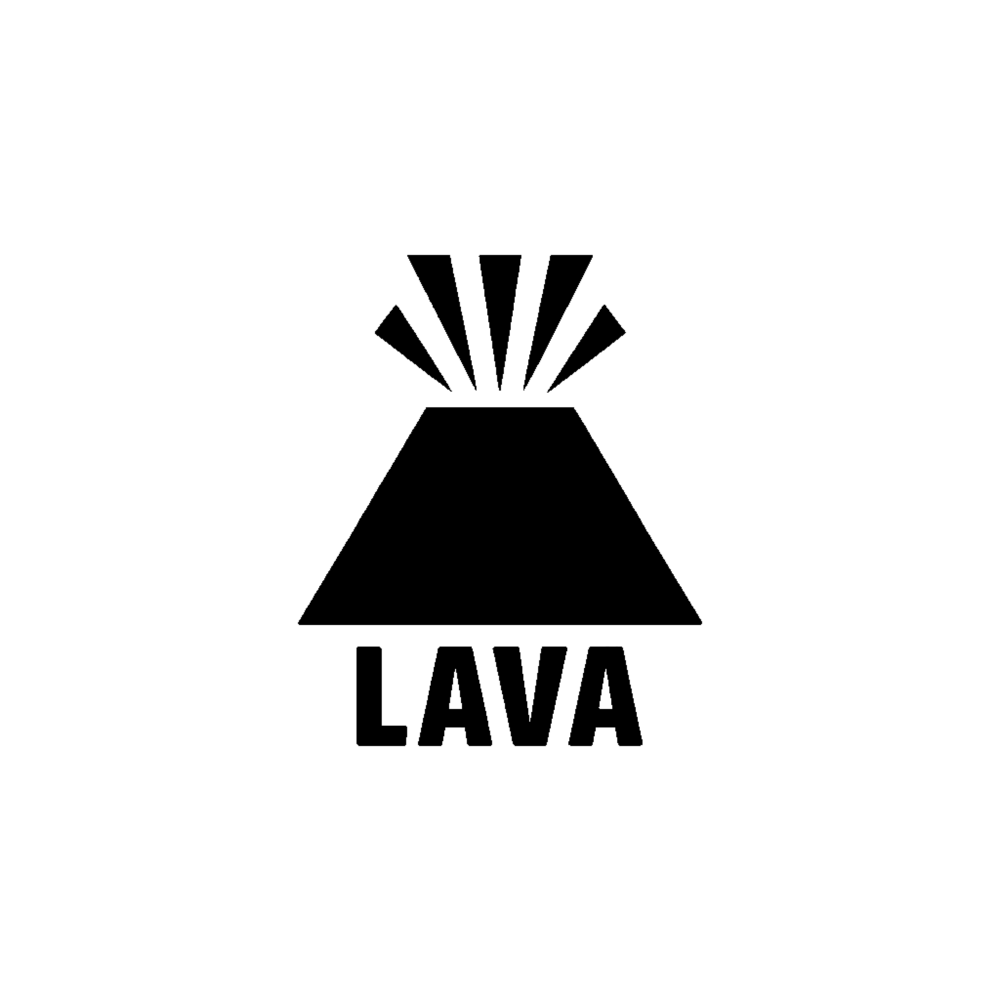

# Lava Game Engine



A modern, cross-platform 3D game engine built with OpenGL, designed for Windows platform development. Lava provides a comprehensive set of tools and systems for creating interactive applications and games.

## 🚀 Features

### Core Engine Systems
- **Application Framework**: Robust application lifecycle management with layer-based architecture
- **Event System**: Comprehensive event handling for window, input, and custom events
- **Layer Stack**: Flexible layer management system for organizing game logic and rendering
- **Logging System**: Integrated logging with multiple levels using spdlog
- **Profiling Support**: Built-in performance profiling capabilities

### Rendering Pipeline
- **OpenGL Renderer**: Modern OpenGL-based rendering system
- **2D/3D Rendering**: Support for both 2D sprites and 3D meshes
- **Shader System**: Flexible shader management and compilation
- **Material System**: Advanced material system with uniform data management
- **Texture Support**: Comprehensive texture loading and management
- **Framebuffer System**: Custom framebuffer support for post-processing effects
- **Post-Processing**: Built-in post-processing pipeline

### Scene Management
- **Entity Component System (ECS)**: Modern ECS architecture using EnTT
- **Scene Graph**: Hierarchical scene management
- **Component System**: Rich set of built-in components:
  - Transform Component
  - Renderable Component
  - Camera Component
  - Light Source Component
  - Material Component
  - Static Mesh Component
  - Spring Arm Component
  - And more...

### Camera System
- **Multiple Camera Types**: Orthographic and perspective cameras
- **Camera Controllers**: Built-in camera controllers for easy navigation
- **Scene Camera**: Specialized camera system for scene editing

### Input System
- **Cross-platform Input**: Unified input handling across platforms
- **Keyboard & Mouse**: Complete keyboard and mouse input support
- **Custom Key Codes**: Engine-specific key code definitions

### Editor Tools
- **Volcano Editor**: Built-in scene editor application
- **Scene Hierarchy Panel**: Visual scene management interface
- **ImGui Integration**: Immediate mode GUI for debug interfaces and tools

### Asset Management
- **Texture Loading**: Support for various image formats via stb_image
- **3D Model Loading**: 3D model support through Assimp integration
- **Shader Loading**: Dynamic shader compilation and hot-reloading

## 🏗️ Architecture

Lava follows a modular architecture with clear separation of concerns:

```
Lava/
├── Core/           # Application framework, events, layers
├── Renderer/       # Rendering pipeline and graphics API
├── Scene/          # Scene management and ECS
├── Component/      # ECS components
├── ImGui/          # GUI integration
├── Events/         # Event system
├── Material/       # Material and shader system
├── Mesh/           # 3D mesh handling
└── Platform/       # Platform-specific implementations
```

## 🛠️ Building the Project

### Prerequisites
- Visual Studio 2019 or later
- Windows 10/11
- Python (for build scripts)

### Build Steps
1. Clone the repository:
   ```bash
   git clone <repository-url>
   cd Lava
   ```

2. Generate project files:
   ```bash
   GenerateProject.bat
   ```

3. Open `Lava.sln` in Visual Studio

4. Build the solution (Ctrl+Shift+B)

## 🎮 Getting Started

### Creating Your First Application

1. Create a new class that inherits from `Lava::Application`:

```cpp
#include <Lava.h>
#include <LavaEntryPoint.h>

class MyGameApp : public Lava::Application
{
public:
    MyGameApp() = default;
    ~MyGameApp() override = default;

private:
    void OnBegin() override
    {
        Application::OnBegin();
        
        // Initialize your game layers here
        Push(new MyGameLayer());
    }
};

namespace Lava
{
    void RegisterApplication()
    {
        Application::Register<MyGameApp>();
    }
}
```

2. Create game layers by inheriting from `Lava::Layer`:

```cpp
class MyGameLayer : public Lava::Layer
{
public:
    MyGameLayer() : Layer("MyGame") {}
    
    void OnAttach() override
    {
        // Initialize resources
    }
    
    void OnUpdate(Lava::Timestep ts) override
    {
        // Update game logic
    }
    
    void OnEvent(Lava::Event* event) override
    {
        // Handle events
    }
    
    void OnGuiRender() override
    {
        // Render GUI
    }
};
```

### Using the Renderer

```cpp
// Initialize renderer
Lava::RenderCommand::Init();

// Create and bind vertex array
auto vertexArray = Lava::VertexArray::Create();

// Create shader
auto shader = Lava::Shader::Create("assets/shaders/Basic.vert", 
                                   "assets/shaders/Basic.frag");

// Render
Lava::RenderCommand::Clear();
Lava::Renderer::BeginScene(camera);
Lava::Renderer::Submit(shader, vertexArray);
Lava::Renderer::EndScene();
```

### Working with Entities and Components

```cpp
// Create a new scene
auto scene = Lava::Scene::Create();

// Create an entity
auto entity = scene->CreateEntity("MyEntity");

// Add components
entity.AddComponent<Lava::TransformComponent>();
entity.AddComponent<Lava::RenderableComponent>();
entity.AddComponent<Lava::MaterialComponent>();

// Get components
auto& transform = entity.GetComponent<Lava::TransformComponent>();
transform.Translation = { 1.0f, 2.0f, 3.0f };
```

## 📁 Project Structure

- **Lava/**: Core engine library
  - **src/Lava/**: Engine source code
    - **Core/**: Application framework and utilities
    - **Renderer/**: Rendering system and OpenGL abstraction
    - **Scene/**: Scene management and ECS
    - **Component/**: Built-in component types
    - **Events/**: Event system implementation
    - **ImGui/**: Dear ImGui integration
- **Sandbox/**: Example sandbox application for testing
- **Volcano/**: Scene editor application
- **vendor/**: Third-party dependencies
- **assets/**: Shaders, textures, and other resources

## 🔧 Dependencies

- **GLFW**: Window management and input handling
- **GLAD**: OpenGL function loader
- **ImGui**: Immediate mode GUI framework
- **GLM**: OpenGL Mathematics library
- **spdlog**: Fast C++ logging library
- **stb_image**: Image loading library
- **EnTT**: Entity Component System library
- **Assimp**: 3D model loading library

## 🎯 Sample Applications

### Volcano Editor
The built-in scene editor provides:
- Scene hierarchy management
- Component editing interface
- Real-time rendering preview
- Asset management tools
- Material and shader editing

Run the editor:
```bash
# After building
cd bin/Debug-windows-x86_64/Volcano
./Volcano.exe
```

### Sandbox
A playground application for testing engine features and experimenting with new functionality.

```bash
# After building
cd bin/Debug-windows-x86_64/Sandbox
./Sandbox.exe
```

## 🎨 Material System

Lava includes a sophisticated material system that allows you to:
- Define custom shaders with uniform parameters
- Create reusable material templates
- Balance flexibility and performance
- Hot-reload shaders during development

See `docs/Material System.md` for detailed documentation.

## 🔧 Configuration

### Build Configurations
- **Debug**: Full debugging symbols, assertions enabled
- **Release**: Optimized build with some debugging info
- **Dist**: Distribution build, fully optimized

### Profiling
Lava includes built-in profiling support. Profile data is saved to:
```
Debug/Profile/
├── StartUp.json
├── Running.json
└── Shutdown.json
```

## 📚 Documentation

Additional documentation can be found in the `docs/` folder:
- Material System overview and usage
- Component system guides
- Rendering pipeline documentation
- Performance optimization tips

## 🚀 Advanced Features

### Custom Components
Create your own components by following the ECS pattern:

```cpp
struct MyCustomComponent
{
    float value = 0.0f;
    std::string name;
    
    MyCustomComponent() = default;
    MyCustomComponent(float v, const std::string& n) 
        : value(v), name(n) {}
};
```

### Custom Shaders
Place your shaders in the assets directory:
```
assets/
└── shaders/
    ├── MyShader.vert
    └── MyShader.frag
```

### Post-Processing Effects
Implement custom post-processing effects using the framebuffer system.

## 📊 Engine Comparison & Analysis

### Current State vs Popular Engines

#### **Unity Comparison**
- ✅ **Similar**: Component-based architecture, Scene management
- ❌ **Missing**: Visual scripting, Asset pipeline, Cross-platform deployment, Physics engine, Audio system
- ❌ **Missing**: Advanced lighting (Global Illumination, Light probes), Animation system, Particle systems

#### **Unreal Engine Comparison**
- ✅ **Similar**: C++ foundation, Material system concept
- ❌ **Missing**: Blueprint visual scripting, Advanced rendering (PBR, Ray tracing), Physics (Chaos), Networking
- ❌ **Missing**: World composition, Landscape tools, AI framework, VR/AR support

#### **Godot Comparison**
- ✅ **Similar**: Open source, Scene system, Node-based architecture
- ❌ **Missing**: GDScript/C# scripting, Built-in physics, Animation tools, Cross-platform export
- ❌ **Missing**: Mobile deployment, Web deployment, Console support

#### **Custom Engine Strengths**
- ✅ **Educational value**: Clear, readable codebase
- ✅ **Lightweight**: Minimal dependencies, fast compilation
- ✅ **Customizable**: Full source control, no licensing restrictions
- ✅ **Modern C++**: Good architecture patterns, smart pointers
- ✅ **AI/ML Focus**: Cutting-edge experimental animation and AIGC integration

## 📋 AI-Focused Development Roadmap & TODO List

### 🔴 **Phase 1: Core Infrastructure & Third-Party Integration (Months 1-3)**

#### **High Priority - Foundation with Proven Libraries**
- [ ] **Custom ECS System**
  - [ ] Replace EnTT with custom ECS implementation
  - [ ] Component serialization/deserialization
  - [ ] ECS performance optimization for AI workloads
  - [ ] Multi-threaded component updates

- [ ] **Rendering Engine Integration**
  - [ ] OGRE 3D integration as rendering backend
  - [ ] OGRE scene graph adaptation to Lava ECS
  - [ ] Material system bridge between Lava and OGRE
  - [ ] Performance profiling and optimization

- [ ] **Asset Pipeline Integration**
  - [ ] Enhanced Assimp integration for complex models
  - [ ] Animation data import from FBX, GLTF
  - [ ] Texture and material import optimization
  - [ ] Asset hot-reloading system

- [ ] **UI System Integration**
  - [ ] RayGUI integration for game UI
  - [ ] ImGui enhancement for editor tools
  - [ ] UI component system for ECS
  - [ ] Cross-platform UI rendering

### 🟡 **Phase 2: AI/ML Animation Framework (Months 4-6)**

#### **High Priority - Experimental Animation Systems**
- [ ] **Neural Network Infrastructure**
  - [ ] TensorFlow Lite C++ integration
  - [ ] ONNX Runtime integration for model inference
  - [ ] GPU acceleration with CUDA/OpenCL
  - [ ] Memory-efficient neural network execution

- [ ] **PFNN (Phase-Functioned Neural Network) Implementation**
  - [ ] PFNN architecture implementation
  - [ ] Locomotion synthesis system
  - [ ] Real-time character control integration
  - [ ] Terrain adaptation algorithms
  - [ ] Performance optimization for real-time usage

- [ ] **DeepMimic Integration**
  - [ ] Motion capture data processing pipeline
  - [ ] Physics-based character simulation
  - [ ] Reinforcement learning integration
  - [ ] Real-time motion synthesis
  - [ ] Character behavior adaptation system

- [ ] **Animation Data Management**
  - [ ] Motion capture data format support (BVH, FBX)
  - [ ] Animation compression algorithms
  - [ ] Temporal data interpolation
  - [ ] Animation blending with neural networks

### 🟢 **Phase 3: AIGC Systems & Advanced AI (Months 7-9)**

#### **Medium Priority - AI Content Generation**
- [ ] **Procedural Content Generation**
  - [ ] Neural terrain generation
  - [ ] AI-driven texture synthesis
  - [ ] Procedural animation generation
  - [ ] Level design assistance tools

- [ ] **Language Model Integration**
  - [ ] LLM integration for dialogue generation
  - [ ] Code generation assistance in editor
  - [ ] Natural language to animation conversion
  - [ ] AI-assisted asset creation

- [ ] **Computer Vision Integration**
  - [ ] Motion capture from video input
  - [ ] Real-time pose estimation
  - [ ] Facial animation from video
  - [ ] Style transfer for textures and materials

- [ ] **Generative Models**
  - [ ] GAN integration for texture generation
  - [ ] Variational autoencoders for animation
  - [ ] Diffusion models for asset creation
  - [ ] Neural style transfer

### 🔵 **Phase 4: Advanced AI Features & Optimization (Months 10-12)**

#### **Low Priority - Professional AI Tools**
- [ ] **Advanced Character AI**
  - [ ] Behavior tree integration with neural networks
  - [ ] Emotional state modeling
  - [ ] Adaptive character personalities
  - [ ] Multi-agent coordination systems

- [ ] **Performance Optimization**
  - [ ] Neural network quantization
  - [ ] Model pruning and compression
  - [ ] GPU memory optimization
  - [ ] Real-time inference optimization

- [ ] **AI Training Pipeline**
  - [ ] In-engine training data collection
  - [ ] Distributed training system
  - [ ] Transfer learning frameworks
  - [ ] Automated hyperparameter tuning

- [ ] **Research Integration**
  - [ ] Latest ML research paper implementations
  - [ ] Experimental animation techniques
  - [ ] Novel neural architectures
  - [ ] Academic collaboration tools

### 📅 **Detailed AI-Focused Schedule**

#### **Quarter 1 (Months 1-3): Infrastructure**
- **Month 1**: Custom ECS system + OGRE integration planning
- **Month 2**: OGRE rendering backend + Assimp enhancement
- **Month 3**: RayGUI integration + Asset pipeline completion

#### **Quarter 2 (Months 4-6): Core AI Animation**
- **Month 4**: Neural network infrastructure + TensorFlow Lite setup
- **Month 5**: PFNN implementation + locomotion synthesis
- **Month 6**: DeepMimic integration + physics-based animation

#### **Quarter 3 (Months 7-9): AIGC Systems**
- **Month 7**: Procedural content generation + LLM integration
- **Month 8**: Computer vision features + motion capture
- **Month 9**: Generative models + style transfer

#### **Quarter 4 (Months 10-12): Advanced Features**
- **Month 10**: Advanced character AI + behavior modeling
- **Month 11**: Performance optimization + model compression
- **Month 12**: Research integration + academic features

### 🧠 **AI/ML Technology Stack**

#### **Core ML Libraries**
- **TensorFlow Lite**: Lightweight inference engine
- **ONNX Runtime**: Cross-platform ML inference
- **PyTorch C++**: Research and experimentation
- **OpenCV**: Computer vision tasks
- **Eigen**: Linear algebra operations

#### **Animation & Motion**
- **Bullet Physics**: Physics simulation for DeepMimic
- **Motion capture libraries**: BVH, FBX parsing
- **Interpolation algorithms**: Spline, neural interpolation
- **Character rigging**: Bone hierarchy management

#### **Rendering Integration**
- **OGRE 3D**: Primary rendering engine
- **OGRE Terrain**: Procedural terrain rendering
- **OGRE Particles**: Particle system integration
- **Custom shaders**: Neural network-driven effects

### 🎯 **AI-Specific Success Metrics**

#### **Technical Benchmarks**
- [ ] Real-time PFNN inference at 60fps for 10+ characters
- [ ] DeepMimic training convergence within 24 hours
- [ ] Neural texture generation in under 5 seconds
- [ ] Motion capture to animation pipeline under 1 second latency

#### **Feature Completeness**
- [ ] Complete PFNN locomotion system
- [ ] Working DeepMimic implementation
- [ ] AI content generation tools
- [ ] Academic research integration framework

#### **Research Goals**
- [ ] Publish research papers on novel techniques
- [ ] Open-source AI animation datasets
- [ ] Collaboration with academic institutions
- [ ] Industry partnerships for validation

### 🚨 **Critical AI Dependencies**

#### **Immediate Technical Decisions**
1. **ML Framework**: TensorFlow Lite vs ONNX Runtime vs PyTorch C++
2. **Physics Engine**: Bullet Physics vs custom implementation for DeepMimic
3. **ECS Architecture**: Performance vs flexibility trade-offs
4. **GPU Acceleration**: CUDA vs OpenCL vs vendor-agnostic

#### **Research & Data Requirements**
1. **Motion Capture Data**: Acquisition and licensing
2. **Training Datasets**: Character animation, terrain, textures
3. **Computational Resources**: GPU clusters for training
4. **Academic Partnerships**: Research collaboration agreements

### 📈 **Specialized Resource Requirements**

#### **AI/ML Development Team**
- **1 ML Engineer**: Neural network architecture and training
- **1 Animation Researcher**: PFNN and DeepMimic expertise
- **1 Computer Vision Specialist**: Motion capture and CV integration
- **1 Core Engine Developer**: ECS and third-party integration
- **1 Graphics Programmer**: OGRE integration and optimization

#### **Hardware & Infrastructure**
- **High-end GPUs**: RTX 4090 or similar for training
- **Motion capture equipment**: Cameras, suits, markers
- **Compute cluster access**: For large-scale training
- **Large storage**: Animation datasets and trained models

### 🔬 **Research & Experimental Features**

#### **Cutting-Edge Animation Research**
- **Neural Motion Fields**: Continuous motion representation
- **Adversarial Motion Generation**: GAN-based animation
- **Physics-Informed Neural Networks**: Realistic motion synthesis
- **Transformer-based Animation**: Attention mechanisms for motion

#### **Novel AIGC Applications**
- **Procedural Narrative Generation**: AI storytelling
- **Dynamic Difficulty Adjustment**: ML-based game balancing
- **Player Behavior Prediction**: Adaptive game experiences
- **Real-time Asset Generation**: On-demand content creation

### 🤝 **Academic & Industry Collaboration**

#### **Research Partnerships**
- **Universities**: Animation and ML research labs
- **Game Studios**: Industrial validation and feedback
- **ML Conferences**: SIGGRAPH, NeurIPS, ICML presentations
- **Open Source Community**: Collaborative development

#### **Knowledge Sharing**
- **Technical Blog**: Development progress and insights
- **Research Papers**: Novel techniques and results
- **Open Datasets**: Community-contributed animation data
- **Educational Content**: Tutorials and workshops

---

**Note**: This engine is primarily designed for educational purposes and Windows development. While the architecture supports cross-platform development, additional work may be required for full cross-platform compatibility.
